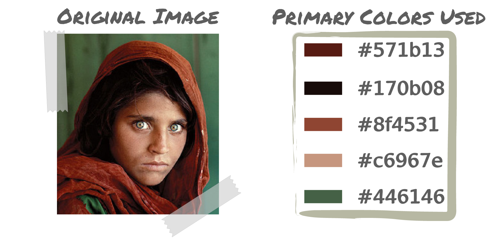
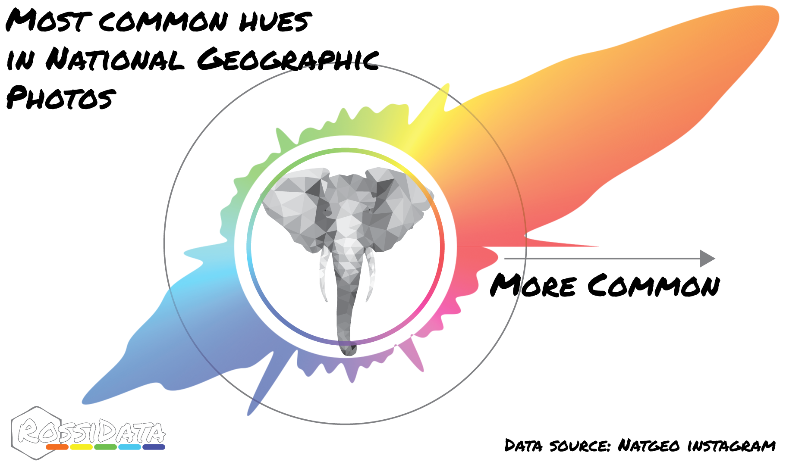

# Color Me Impressed

### Introduction
This project was an extension of the work I read in this [blogpost](http://charlesleifer.com/blog/using-python-and-k-means-to-find-the-dominant-colors-in-images/)
It's a series of funcitons that batch analysze tiffs and then

*note* : These functions always run faster on smaller images. To save yourself someheadache
scale down the images before you run them by using the sip command in bash.

Simply navigate to the image folder and execute:
```
sips -Z 100 *.jpg
```
This will generally preserve the colors but scale everything down.

### Getting the data
I used [instalooter](https://github.com/althonos/InstaLooter) to collect data but any scraping service that allows you to collect large amounts of images should work.


### Analyszing one image

The function photo_colorbar.py takes two arguments: the location of the image and the number of color to extract
```python
python3 photo_colorbar.py %PathToImage% n
```
As an example of n=5, we see this function will generate an output like this:



### Batch Analysis

To find the primary colors in a series of images you can call the following function
```python
python3 batch_color_analyzer.py %PathToImageDirectory% n
```

This will save a pickled python list of lists called "storage.pkl" containing the "n" most promoinent colors for each image in the directory.

### Plotting

To generate unique radial plots using the extracted data you can simple run the function:
```python
python3 color_histogram_plot.py
```
This will load "storage.pkl" and generate a smoothed radial histogram based on the hues of the scraped images.
*note: * There are many ways to visulaize distributions of color, here we simply discard black and white and look at the predominance of the colors
of the rainbow.


